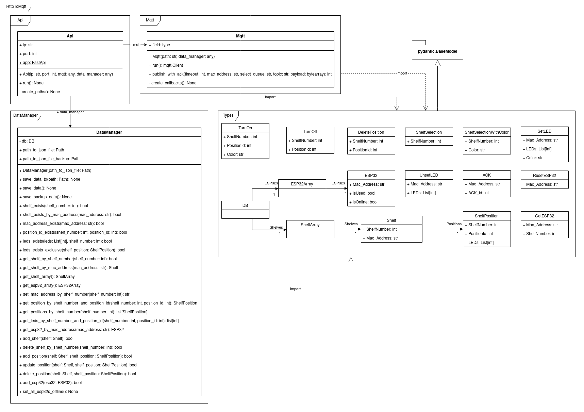
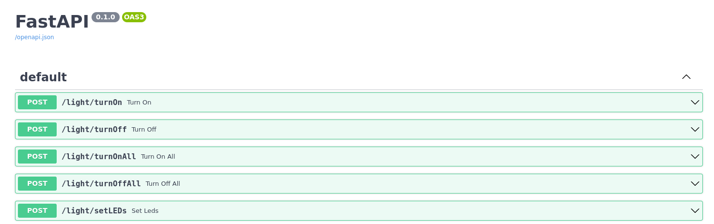

# HttpToMqtt

| Requirements       |
|--------------------|
| Python \>= 3.9     |
| pipenv \>= 2021.5  |

* [Install Guide](./docs/install.md)
* [Setup and Run Module](./docs/execution.md)
* [Code Documentation Api-Module](./docs/api.md)
* [Code Documentation DataManager-Module](./docs/DataManager.md)
* [Code Documentation Mqtt-Module](./docs/mqtt.md)
* [Code Documentation Types-Module](./docs/types.md)

## Description
This Python Module is part of the [Pick-By-Light](https://github.com/PBL-Pick-By-Light) system, it accepts 
requests from the Backend and Frontend via a REST-API and sends them as MQTT requests to the ESP32s. It also 
manages the connected ESP32s, via a simple database, and assigns the LEDs to their respective Positions.

## Swagger Docs

To access the automatically created Swagger docs open the url `<your base address>:<port>/docs`, while the module 
is running, in your web browser. If the server runs on default settings: http://127.0.0.1:8000/docs

## License

[Apache License 2.0](https://www.tldrlegal.com/l/apache2)
