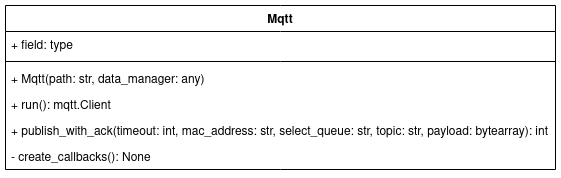


 # Mqtt
 
Submodule that manages the MQTT communication between the HttpToMqtt Server and ESP32s.

   
## **Modules**
The Mqtt submodule uses the following python modules:
* [json](https://docs.python.org/3/library/json.html)  

* [paho.mqtt.client](https://pypi.org/project/paho-mqtt/)  

* [random](https://docs.python.org/3/library/random.html)  

* [time](https://docs.python.org/3/library/time.html)  

## **UML Class Diagram**

   
## **Class Mqtt**

class **Mqtt**(builtins.object)

**Mqtt**(path: str, data\_manager)  
   
A class to represent a MQTT module that has a MQTT client and access to a JSON database.  
### **Attributes**  
***
**conf\_path** : str  
    Path to the configuration JSON file that contains all the necessary information to set up the MQTT client.  
**data\_manager** : [DataManager](./DataManager.md)  
    Object representing the data manager that adds, updates, finds and deletes data from the JSON database.  
**light\_ack\_queue** : list\[[ACK](./types.md#ack)\]  
    Queue for the ACKs coming from all operations over the pbl/+/light MQTT topic.  
**config\_ack\_queue** : list\[[ACK](./types.md#ack)\]  
    Queue for the ACKs coming from all operations over the pbl/+/config MQTT topic.  
**config** : dict  
    Object representing the deserialized JSON file in conf\_path.  
**client** : paho.mqtt.client.Client  
    MQTT client that sends and receives messages to and from the ESP32s. 

***
### Methods defined here:  

**\_\_init\_\_**(self, path: str, data\_manager)

Constructs an instance of a MQTT module that has access to stored  
data in a JSON file.  
   
**Parameters**
**path** : str  
    Path to the configuration JSON file that contains all the necessary information to set up the MQTT client.  
**data\_manager** : DataManager  
    Object representing the data manager that adds, updates, finds and deletes data from the JSON database.
***
**publish\_with\_ack**(self, timeout: int, mac\_address: str, select\_queue: str, topic: str, payload: bytearray) -> `int`

Publishes a MQTT message (payload) to the specified topic using the specified select\_queue ("light\_ack" or "config\_ack") in order to get ACKs from the ESP32 to which the message was sent.    
If in 'timeout' seconds an ACK has not returned from the ESP32  to which the message was sent the status code 504 (HTTP\_504\_GATEWAY\_TIMEOUT) is returned. After an ACK has come the status code 200 (HTTP\_200\_OK) is returned.  
   
**Parameters**  
**timeout** : int  
    Seconds to wait for an ACK.  
**mac\_address** : str  
    String representing the MAC-address of the ESP32 that the message is being sent to.  
**select\_queue** : str  
    String to choose which queue should be used for waiting for the ACK. There are just two possible values, "light\_ack" or "config\_ack".  
**topic** : str  
    MQTT topic to which the message should be published.  
**payload** : bytearray  
    Byte array containing the raw data to be sent.  
   
**Returns**  
A status code that depends on how the operation went. If in 'timeout' seconds an ACK has not returned from the ESP32 to which the message was sent the status code 504 (HTTP\_504\_GATEWAY\_TIMEOUT) is returned. After an ACK has come the status code 200 (HTTP\_200\_OK) is returned.
***
**run**(self) -> `paho.mqtt.client.Client`

Registers the callbacks for the MQTT client and connects it to the specified MQTT-broker in the configuration JSON file. Then it starts the loops that receive messages and handles them.  
   
**Returns**  
The reference to the MQTT client of the MQTT module.
***
