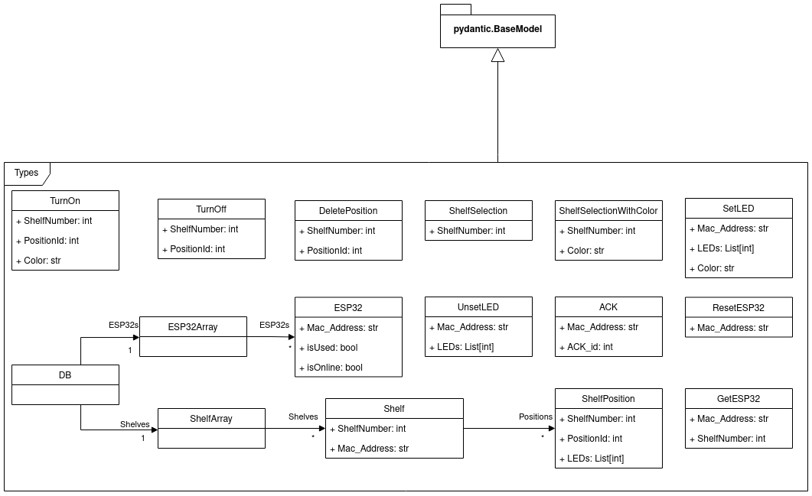

# Types
This submodule contains all data types necessary for the `POST` bodies for the different [HTTP routes](./../README.md#swagger-docs) and data stored in the database from the [DataManager](./DataManager.md).

## **UML Class Diagram**

## **Classes**

[ACK](#ack)

[DB](#db)

[DeletePosition](#deleteposition)

[ESP32](#esp32)

[ESP32Array](#esp32array)

[ResetESP32](#resetesp32)

[SetLED](#setled)

[Shelf](#shelf)

[ShelfArray](#shelfarray)

[ShelfPosition](#shelfposition)

[ShelfSelection](#shelfselection)

[ShelfSelectionWithColor](#shelfselectionwithcolor)

[TurnOff](#turnoff)

[TurnOn](#turnon)

[UnsetLED](#unsetled)
***
### ACK  
class **ACK**([pydantic.main.BaseModel](https://pydantic-docs.helpmanual.io/usage/models/))

   

[**ACK**](#ack)(\*, Mac\_Address: str, ACK\_id: int)   
   
Dataclass representing an [ACK](#ack).  
ACKs are used to ensure that messages were sent to ESP32s and that these were able to do the needed operations.  
An [ACK](#ack) has a unique ID that is used to identify it while waiting for it on the server side. After it has been received it is removed from the queue.  
   
**Attributes**  
**Mac\_Address:** str  
MAC-Address of the [ESP32](#esp32) that is sending the [ACK](#ack).  
**ACK\_id:** int  
ID that uniquely identifies the [ACK](#ack) being sent and received. With this ID it is possible to uniquely identify operations performed by the ESP32s. 
***
### DB
   
class **DB**([pydantic.main.BaseModel](https://pydantic-docs.helpmanual.io/usage/models/))

[**DB**](#db)(\*, Shelves: \_\_init\_\_.[ShelfArray](#shelfarray), ESP32s: \_\_init\_\_.[ESP32Array](#esp32array)) 
   
Dataclass representing the database managed by the class  
DataManager.  
Here all data concerning the [Shelf](#shelf) objects and [ESP32](#esp32) objects is stored and can be serialized in order to be stored in a JSON text file.  
   
**Attributes**  
**Shelves**: [ShelfArray](#shelfarray)  
[ShelfArray](#shelfarray) containing all [Shelf](#shelf) objects. This would be equivalent to a table in a SQL database. Every time CRUD-operations are performed on the database they are being made on this [ShelfArray](#ShelfArray) object.  
**ESP32s**: [ESP32Array](#shelfarray)  
[ESP32Array](#shelfarray) containing all [ESP32](#esp32) objects. This would be equivalent to a table in a SQL database. Every time CRUD-operations are performed on the database they are being made on this [ESP32Array](#ESP32Array) object. 
***
   ### DeletePosition
class **DeletePosition**([pydantic.main.BaseModel](https://pydantic-docs.helpmanual.io/usage/models/))

   

[**DeletePosition**](#deleteposition)(\*, ShelfNumber: int, PositionId: int)   
   
Dataclass to delete a position with the  
PositionId in the [Shelf](#shelf) with the corresponding  
ShelfNumber.  
Delete-body for light/deletePosition.  
   
**Attributes**  
**ShelfNumber** : int  
ShelfNumber of the [Shelf](#shelf) of which a [ShelfPosition](#shelfposition) has to be deleted.  
**PositionId** : int  
PositionId of the [ShelfPosition](#ShelfPosition) that has to be deleted. 
***
### ESP32
class **ESP32**([pydantic.main.BaseModel](https://pydantic-docs.helpmanual.io/usage/models/))

[**ESP32**](#esp32)(\*, Mac\_Address: str, isUsed: bool, isOnline: bool)   
   
Dataclass representing a registered [ESP32](#esp32).  
Its MAC address is stored along with the status flags :  
`isUsed` and `isOnline`.  
When isUsed is `True` this means that this [ESP32](#esp32) has been assigned to a [Shelf](#Shelf) in the database.  
`isOnline` gives information about the connection status of the [ESP32](#esp32).  
   
**Attributes**  
**Mac\_Address**: str  
Physical MAC-Address of an [ESP32](#esp32). Preferred format is 'FF:FF:FF:FF:FF:FF'  
**isUsed**: bool  
When isUsed is True this means that this [ESP32](#esp32) has been  
assigned to a [Shelf](#shelf) in the database.  
**isOnline**: bool  
Information about the connection status of the [ESP32](#esp32). 
***
### ESP32Array
   
class **ESP32Array**([pydantic.main.BaseModel](https://pydantic-docs.helpmanual.io/usage/models/))

   

[**ESP32Array**](#shelfarray)(\*, ESP32s: List\[\_\_init\_\_.[ESP32](#esp32)\] = \[\])   
   
Dataclass that represents a List of [ESP32](#esp32) objects.  
This class is needed for the validation while creating the  
[DB](#db) object.  
   
**Attributes**  
ESP32s: List\[[ESP32](#esp32)\]  
List of [ESP32](#esp32) objects contained in the [DB](#db) object. 
***
  ### ResetESP32
class **ResetESP32**([pydantic.main.BaseModel](https://pydantic-docs.helpmanual.io/usage/models/))

   

[**ResetESP32**](#resetesp32)(\*, Mac\_Address: str)   
   
Dataclass to reset the [ESP32](#esp32) with the specified Mac\_Address.  
Post-body for `light/resetESP32`.  
   
**Attributes**  
**Mac\_Address**: str  
MAC-Address of the [ESP32](#esp32) that has to be reset. 
***
### SetLED
class **SetLED**([pydantic.main.BaseModel](https://pydantic-docs.helpmanual.io/usage/models/))

[**SetLED**](#setled)(\*, Mac\_Address: str, LEDs: List\[int\], Color: str)   
   
Dataclass to turn a specific LED array on  
independently of a PositionId or the database.  
LEDs will shine with the given color at the [ESP32](#esp32) with the given Mac\_Address.  
Post-body for `light/setLEDs`.  
   
**Attributes**  
**Mac\_Address**: str  
MAC-Address of the [ESP32](#esp32) on which the LEDs should be set (turned on).  
**LEDs**: List\[int\]  
List of integer values representing the LEDs that should be set (turned on).  
**Color**: str  
String containing the RGB values with which the LEDs should be set (turned on).  
The format of the string has to be #FFFFFF. 
***
### Shelf
class **Shelf**([pydantic.main.BaseModel](https://pydantic-docs.helpmanual.io/usage/models/))

[Shelf](#shelf)(\*, ShelfNumber: int, Mac\_Address: str, Positions: List\[\_\_init\_\_.[ShelfPosition](#shelfposition)\] = \[\])   
   
Dataclass that represents a [Shelf](#shelf).  
It has a unique ShelfNumber and the MAC address  
of the [ESP32](#esp32) that has been assigned to this [Shelf](#shelf).  
It contains all the [ShelfPosition](#shelfposition) objects registered in this [Shelf](#shelf).  
   
**Attributes**  
**ShelfNumber** : int  
This number uniquely identifies the [Shelf](#shelf).  
**Mac\_Address**: str  
MAC-Address of the [ESP32](#esp32) that has been assigned to this [Shelf](#shelf).  
**Positions**: List\[[ShelfPosition](#shelfposition)\]  
List of [ShelfPosition](#shelfposition) objects containing all [ShelfPosition](#shelfposition) objects stored in this [Shelf](#shelf). 
***
### ShelfArray
class **ShelfArray**([pydantic.main.BaseModel](https://pydantic-docs.helpmanual.io/usage/models/))

   

[ShelfArray](#shelfarray)(\*, Shelves: List\[\_\_init\_\_.[Shelf](#shelf)\] = \[\])   
   
Dataclass that represents a List of [Shelf](#shelf) objects.  
This class is needed for the validation while creating the  
[DB](#db) object.  
   
**Attributes**  
Shelves: List\[[Shelf](#shelf)\]  
List of [Shelf](#shelf) objects contained in the [DB](#db) object. 
***
### ShelfPosition
class **ShelfPosition**([pydantic.main.BaseModel](https://pydantic-docs.helpmanual.io/usage/models/))

   

[ShelfPosition](#shelfposition)(\*, ShelfNumber: int, PositionId: int, LEDs: List\[int\] = \[\])   
   
Dataclass that represent a position  
in a [Shelf](#shelf). It contains the number of the  
[Shelf](#shelf) it is in and its unique ID. The LEDs  
int list containing all LEDs of the position  
int the LED stripe.  
   
**Attributes**  
**ShelfNumber** : int  
ShelfNumber of the [Shelf](#shelf) in which this [ShelfPosition](#shelfposition) is stored.  
**PositionId** : int  
PositionId of the [ShelfPosition](#shelfposition) that uniquely identifies this position on the [Shelf](#shelf).  
**LEDs**: List\[int\]  
List of integer values representing the LEDs that belong to this [ShelfPosition](#shelfposition).  
These integer values are in the range 0-255 (a byte sized unsigned integer). 
***
### ShelfSelection
class **ShelfSelection**([pydantic.main.BaseModel](https://pydantic-docs.helpmanual.io/usage/models/))

[ShelfSelection](#shelfselection)(\*, ShelfNumber: int)   
   
Dataclass to ensure a ShelfNumber from  
int type was given.  
Post-body for `light/turnOffAll`.  
   
**Attributes**  
**ShelfNumber** : int  
ShelfNumber of the [Shelf](#shelf) to be selected. 
***
### ShelfSelectionWithColor
class **ShelfSelectionWithColor**([pydantic.main.BaseModel](https://pydantic-docs.helpmanual.io/usage/models/))

   

[ShelfSelectionWithColor](#shelfselectionwithcolor)(\*, ShelfNumber: int, Color: str)  
   
Dataclass to ensure a ShelfNumber from  
int type was given and a color.  
Post-body for `light/turnOnAll`.  
   
**Attributes**  
**ShelfNumber** : int  
ShelfNumber of the [Shelf](#shelf) to be selected.  
**Color** : str  
String containing the RGB values with which the LEDs should be turned on.  
The format of the string has to be #FFFFFF. 
***
### TurnOff

class **TurnOff**([pydantic.main.BaseModel](https://pydantic-docs.helpmanual.io/usage/models/))

   

[TurnOff](#turnoff)(\*, ShelfNumber: int, PositionId: int)  
   
Dataclass to turn LEDs off in  
the given [Shelf](#shelf) at the given position.  
Post-body for `light/turnOff`.  
   
**Attributes**  
**ShelfNumber** : int  
ShelfNumber of the [Shelf](#shelf) on which LEDs should be turned off.  
**PositionId** : int  
PositionId of the [ShelfPosition](#shelfposition) on which LEDs should be turned off. 
***
### TurnOn

class **TurnOn**([pydantic.main.BaseModel](https://pydantic-docs.helpmanual.io/usage/models/))

[TurnOn](#turnon)(\*, ShelfNumber: int, PositionId: int, Color: str) 
   
Dataclass to turn LEDs on in  
the given [Shelf](#shelf) at the given position.  
Post-body for `light/turnOn`.  
   
**Attributes**  
**ShelfNumber** : int  
ShelfNumber of the [Shelf](#shelf) on which LEDs should be turned on.  
**PositionId** : int  
PositionId of the [ShelfPosition](#shelfposition) on which LEDs should be turned on.  
**Color** : str  
String containing the RGB values with which the LEDs should be turned on.  
The format of the string has to be #FFFFFF. 
***
### UnsetLED

class **UnsetLED**([pydantic.main.BaseModel](https://pydantic-docs.helpmanual.io/usage/models/))

[UnsetLED](#unsetled)(\*, Mac\_Address: str, LEDs: List\[int\])  
   
Dataclass to turn a specific LED array off  
independently of a PositionId or the database.  
LEDs will be turned off at the [ESP32](#esp32) with the given Mac\_Address.  
Post-body for `light/unsetLEDs`.  
   
**Attributes**  
**Mac\_Address**: str  
MAC-Address of the [ESP32](#esp32) on which the LEDs should be unset (turned off).  
**LEDs**: List\[int\]  
List of integer values representing the LEDs that should be unset (turned off). 
***
